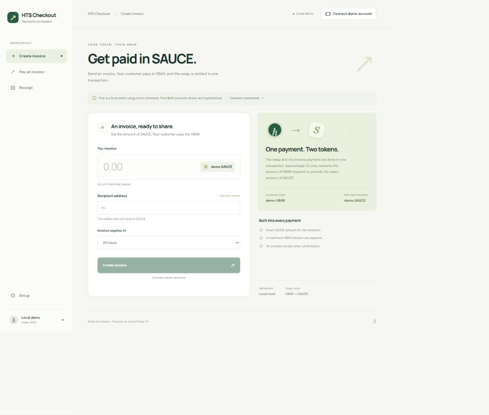

# HTS Checkout



[Watch the 1 min 50 sec demo](https://aamir-azeez.github.io/hts-checkout/demo.html) · [Testnet transaction evidence](docs/testnet-evidence.md)

Create an invoice for an exact token amount. Your customer pays in HBAR, and SaucerSwap only converts what the payment requires. The merchant gets the requested SAUCE amount, and the remaining HBAR goes back to the customer or remains as a withdrawal credit if the refund cannot be issued.

The template integrates invoice generation, spending limits, swap execution, refunds, and receipts into a single reusable workflow. An invoice may be paid only once. If the invoice is expired or the payment amount is over the customer's limit, it will fail without resolving the invoice.

This release is based on Hedera testnet and one supported SAUCE pool. It includes a Next.js interface, a Hardhat contract workspace, contract tests, and setup instructions. Testnet funds are not worth any money.

## Requirements

- Node.js 22.13.0 or newer; development baseline: 24.16.0.
- `npm` 11.18.0 or newer and Git; the pinned package manager is `npm` 11.20.0. Older `npm` versions can silently ignore workspace dependency overrides.
- For testnet signing: a funded Hedera testnet account with an ECDSA key, plus an EVM-compatible browser wallet for the frontend.
- Associate the recipient account with testnet SAUCE token `0.0.1183558` before payment.

The frontend supports Hedera testnet, chain ID 296, and an explicit local mock environment, chain ID 31337. Mainnet is not supported by the deployment script or frontend.

## Install and validate

From the repository root:

```sh
npx --yes npm@11.20.0 ci --ignore-scripts
npm run validate:template
npm run lint
npm run test
npm run build
npm run dev
```

Open `http://127.0.0.1:3000`. Without a checkout address, the interface displays its setup state; it does not have a live deployment configured. A successful build or an accessible page does not establish successful settlement.

The pinned `npx` command leaves your globally installed `npm` unchanged. With `npm` 11.18.0 or newer already installed, `npm ci --ignore-scripts` also uses the committed lockfile. Run `node scripts/validate-template.cjs --self-test` to check the validator's credential patterns and rejection cases independently.

| Command                     | Operation                                                                     |
| --------------------------- | ----------------------------------------------------------------------------- |
| `npm run validate:template` | Check manifest, package layout and explicit public-source credential patterns |
| `npm run lint`              | Run workspace lint/type checks                                                |
| `npm run format:check`      | Check source formatting with pinned Prettier                                  |
| `npm run format`            | Apply source formatting                                                       |
| `npm run test`              | Run local contract and frontend unit tests                                    |
| `npm run build`             | Compile the contracts and build Next.js                                       |
| `npm run dev`               | Start Next.js on the loopback interface                                       |
| `npm run chain`             | Start the local Hardhat EVM                                                   |
| `npm run testnet:probe`     | Read public testnet metadata and simulate pool quotes without signing         |
| `npm run deploy`            | Sign a new checkout deployment on Hedera testnet                              |

The local test suite contains 38 passing tests: 15 contract tests and 23 frontend tests. These checks use local mocks and pure helpers; live settlement evidence is recorded separately in [the testnet verification report](docs/testnet-evidence.md).

## Frontend configuration

Create `packages/nextjs/.env.local` with these public settings:

```dotenv
NEXT_PUBLIC_CHAIN_ID=296
NEXT_PUBLIC_RPC_URL=https://testnet.hashio.io/api
NEXT_PUBLIC_CHECKOUT_ADDRESS=
NEXT_PUBLIC_QUOTER_ADDRESS=0x00000000000000000000000000000000001535b2
```

Set `NEXT_PUBLIC_CHECKOUT_ADDRESS` to the address printed by a successful testnet deployment. Keep it empty until a deployment exists. The checkout supplies its immutable token, router, wrapped-token and fee configuration to the interface.

The file is ignored by Git. Only public configuration belongs in `NEXT_PUBLIC_*` variables: Next.js includes those values in browser code. Do not put signing keys or wallet recovery phrases in this file. Restart `npm run dev` after changing configuration; rebuild when changing configuration used by a production build.

## Local mock walkthrough

In one terminal, keep the local chain running:

```sh
npm run chain
```

In a second terminal, deploy the local fixture:

```sh
npm exec --workspace @hts-checkout/contracts -- hardhat run scripts/deploy-local.cjs --network localhost
```

The fixture prints the checkout, router and token addresses, the merchant address, and a sample one-SAUCE invoice ID. Copy the printed checkout address into `packages/nextjs/.env.local` and use:

```dotenv
NEXT_PUBLIC_CHAIN_ID=31337
NEXT_PUBLIC_RPC_URL=http://127.0.0.1:8545
NEXT_PUBLIC_CHECKOUT_ADDRESS=
NEXT_PUBLIC_QUOTER_ADDRESS=
```

Replace the empty checkout value with the fixture address, then start or restart `npm run dev`. Use the interface's local account connection and open the printed invoice ID. Local signing uses the first unlocked Hardhat account and is enabled only for an explicit loopback RPC. The local quote comes from the mock router's fixed cost; no real SaucerSwap liquidity or HTS association is exercised.

Local native units deliberately emulate the contract's tinybar inputs: pass a raw integer such as `2155441` as local EVM wei. On Hedera testnet, the wallet transaction boundary instead multiplies tinybar by `10^10`. The frontend applies the conversion for chain 296 and omits it for chain 31337. Local balances, quotes and receipts are mock evidence only.

## Testnet deployment and payment verification

First check public prerequisites:

```sh
npm run testnet:probe
```

The probe validates chain 296, the expected router configuration, token decimals, direct WHBAR/SAUCE pool existence, active liquidity and simulated exact-output quotes. It never loads a signing key. Its `settlementVerified: false` result is intentional.

Provide `HEDERA_PRIVATE_KEY` through the deployment process environment using your existing secret-management workflow. This must be a funded testnet ECDSA key. The scripts do not automatically read a credentials file. `HEDERA_RPC_URL` optionally overrides the public testnet RPC.

Run the deployment explicitly:

```sh
npm run deploy
```

The script verifies the network and canonical router configuration before deployment. It prints public deployment metadata, including the checkout address and transaction hash. Set the frontend's checkout address to that deployed address and restart the app.

For a scripted live payment check, set `CHECKOUT_ADDRESS` in the process environment to the deployed checkout, retain the testnet buyer key in `HEDERA_PRIVATE_KEY`, and run:

```sh
node packages/hardhat/scripts/live-e2e.cjs
```

This command submits real testnet transactions. It checks or creates the merchant's SAUCE association, creates a one-SAUCE invoice, obtains an exact-output quote with a 1% input allowance, simulates the payment, then signs settlement. It verifies the recipient balance delta, stored invoice state, refund accounting and duplicate-payment rejection.

An optional `HEDERA_MERCHANT_PRIVATE_KEY` selects a separate merchant signer. Without it, the same operator acts as merchant and buyer, and the output reports that fact. An optional `CHECKOUT_PROOF_PATH` writes evidence to a fresh absolute filename outside the repository; otherwise public evidence is printed. Never include signing keys in evidence.

A signed testnet deployment and one-SAUCE payment between distinct merchant and buyer accounts completed on September 24, 2026 (UTC). The recipient received exactly 1,000,000 SAUCE base units; the payment spent 2,155,446 tinybar and returned 21,555 tinybar of unused principal. Both accounts were operated for this verification. See [public transactions, exact units and verification scope](docs/testnet-evidence.md), including the earlier same-account run. A pool quote or deployment receipt alone does not prove an invoice was paid.

## Invoice, receipt and refund behavior

- SAUCE amounts use 6 decimal places. HBAR contract amounts use 8-decimal tinybar; Ethereum-compatible transaction values use 18-decimal units.
- Invoice IDs are unique, nonzero `bytes32` values. Amounts must be positive and within the signed 64-bit HTS limit. Expiry must be in the future and no more than 365 days away.
- Associate the recipient account with SAUCE before payment. A successful quote does not prove association or recipient eligibility.
- The browser displays a maximum input with a 0.5% allowance and requires a fresh quote. The contract independently enforces maximum input, invoice expiry and the swap deadline. Network fees are additional.
- Successful settlement must increase the recipient's SAUCE balance by the exact invoice amount. Any mismatch or swap failure reverts invoice state changes.
- An invoice can be paid once. If a submitted transaction's receipt is temporarily unavailable, keep its hash and check confirmation before trying another payment.
- The unused input is returned immediately when possible. A rejecting receiver receives a credit under its own address; `withdrawRefund()` withdraws that credit. A failed withdrawal preserves it.
- HashScan links are available for testnet transactions. Local mock transactions have no Hedera explorer record.

## External Scaffold-HBAR template

The external installation target is `aamir-azeez/hts-checkout`. It requires a public repository; the command below remains a verification target until archive-based scaffolding has been checked:

```sh
npx --yes npm@11.20.0 create scaffold-hbar@0.4.0 --yes -- checkout-app --template aamir-azeez/hts-checkout --frontend nextjs-app --solidity-framework hardhat --package-manager="npm" --network testnet --yes --skip-install --skip-hedera-skills
cd checkout-app
npx --yes npm@11.20.0 ci --ignore-scripts
npm run format
```

The manifest restricts generation to Next.js, Hardhat and npm. The scaffolder consumes and removes `template.json` from generated output, so validate a generated project with:

```sh
npm run validate:template -- --scaffolded
npm run lint
npm run test
npm run build
```

The source repository retains its manifest. CLI 0.4.0 initializes Git in the generated directory and rewrites the root and workspace `packageManager` fields to `npm@10.0.0`. The explicit `--skip-install` and pinned `npm` 11.20.0 install above avoid that older toolchain and leave global `npm` unchanged. Template `requirements` records the minimum `npm` version but is not enforced by this CLI version.

## Repository layout

```text
packages/
  hardhat/
    contracts/       Checkout and isolated test doubles
    scripts/         Probe, deployment and live verification
    test/            Contract behavior tests
  nextjs/
    app/             Next.js interface
    lib/             Wallet, chain, amount and interface helpers
    test/            Frontend unit tests
scripts/
  validate-template.cjs
docs/
  architecture.md
template.json
AGENTS.md
LICENSE
```

See [architecture and reproducibility](docs/architecture.md) for contract invariants, public testnet entity IDs and validation boundaries. [AGENTS.md](AGENTS.md) documents the developer workflow. Source code is provided under the [MIT license](LICENSE).
