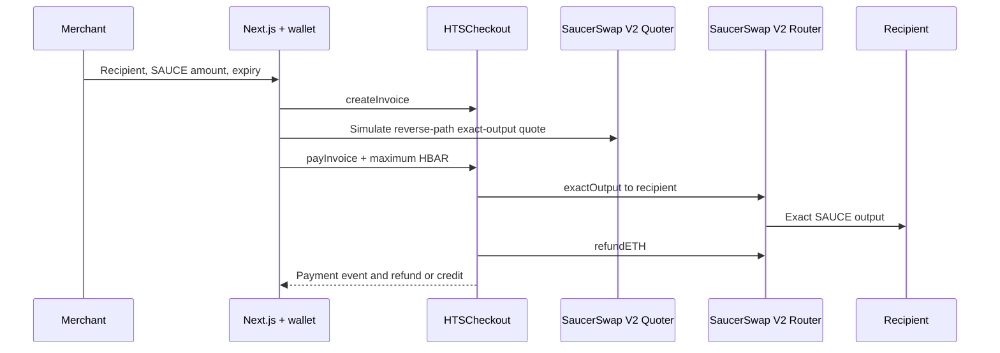

# Architecture and reproducibility

## Scope

HTS Checkout creates invoices for an exact quantity of the SAUCE HTS token. A payer supplies test HBAR; SaucerSwap V2 performs the conversion and sends the output to the invoice recipient in the same transaction. The template supports Hedera testnet, chain ID 296. Chain ID 31337 is an explicit local mock environment.

The contract configuration is immutable: router, output token, wrapped HBAR token and pool fee. There is no admin route that can change an existing checkout's settlement asset. A different asset or pool requires a new deployment and matching frontend configuration.

## Components

| Location                                        | Responsibility                                                          |
| ----------------------------------------------- | ----------------------------------------------------------------------- |
| `packages/hardhat/contracts/HTSCheckout.sol`    | Invoice state, exact-output settlement, input limits and refund credits |
| `packages/hardhat/contracts/test/`              | Local token/router/receiver doubles for isolated failure tests          |
| `packages/hardhat/scripts/testnet-settings.cjs` | Public testnet contract IDs, token decimals and endpoints               |
| `packages/hardhat/scripts/probe.cjs`            | Read-only network, router, token, pool and quote checks                 |
| `packages/hardhat/scripts/deploy.cjs`           | Signed testnet-only deployment with router configuration checks         |
| `packages/hardhat/scripts/deploy-local.cjs`     | Local mock token, router and checkout fixture                           |
| `packages/hardhat/scripts/live-e2e.cjs`         | Explicitly signed token-association, invoice and payment verification   |
| `packages/nextjs/lib/chain.ts`                  | Typed invoice reads, quote path, amount conversion and wallet checks    |
| `packages/nextjs/app/`                          | Invoice creation, payment, receipt and setup interface                  |

The frontend reads public data through the configured RPC and requests signatures from an injected EVM wallet. Deployment reads a signing key from its process environment. No signing service or private key is included in the frontend.



## Invoice and payment state

An invoice ID is a nonzero, unique `bytes32`. The creator's address is recorded as the merchant; the recipient must be nonzero and cannot be the checkout contract. Amounts must be positive and no greater than the signed 64-bit HTS amount limit. Expiry must be in the future and at most 365 days away.

The invoice has one successful payment transition. Duplicate creation and repeated payment revert. An unpaid invoice can no longer be paid after its expiry. The payer also supplies a swap deadline bounded by the current time and the invoice expiry.

Payment sends the declared maximum input to the checkout. The contract requires exact agreement between `msg.value` and `maxInputTinybar`, then calls the immutable router. The exact-output path is packed in reverse order:

```text
SAUCE token address | uint24 pool fee | WHBAR token address
```

The recipient's token balance is measured before and after the swap. The net increase must equal the invoice amount exactly. If the router exceeds the input cap, fails to provide the required refund, or produces a different net output, the complete transaction reverts, including invoice state changes. This check also rejects settlement reduced by unexpected token transfer fees.

The remaining input is returned to the payer. If the payer's receive function rejects the bounded immediate refund, the contract records `refundCredits[payer]`. The payer can call `withdrawRefund()`; a failed withdrawal reverts and preserves its credit. A reentrancy guard covers invoice creation, settlement and withdrawals.

Router surplus returned during the current call is accounted for separately from earlier checkout balances. Existing refund credits and forced native donations cannot be spent to subsidize the current payer's settlement.

## Amount units

| Value                                                                            | Unit                                             | Example                                  |
| -------------------------------------------------------------------------------- | ------------------------------------------------ | ---------------------------------------- |
| Invoice `amountOut`                                                              | SAUCE base units, 6 decimals                     | 1 SAUCE = 1,000,000 units                |
| Quoter input, `maxInputTinybar`, contract `msg.value`, `amountIn`, refund credit | Tinybar, 8 decimals                              | 1 HBAR = 100,000,000 tinybar             |
| Ethereum-compatible JSON-RPC transaction `value` on Hedera                       | 18-decimal native units, sometimes called weibar | 1 HBAR = 1,000,000,000,000,000,000 units |

At the Hedera wallet transaction boundary, multiply tinybar by `10^10`. Display HBAR from a tinybar amount using 8 decimals, and SAUCE using 6. Amounts remain integers or `bigint` throughout quoting and settlement.

The local Hardhat EVM does not perform Hedera's RPC-to-tinybar conversion. Local tests pass the contract's raw input units directly as native value. An explicit local frontend demonstration must use the same convention; do not reuse a Hedera-only conversion on chain 31337.

The input cap covers swap principal. Network transaction fees are additional.

## Association, quotes and confirmations

The recipient must associate its Hedera account with the configured SAUCE token before receiving a payment. Token association is an account prerequisite; creating an invoice or obtaining a quote does not satisfy it. The checkout sends output directly to the recipient rather than holding SAUCE.

Quotes simulate current pool state. Liquidity, price and account state can change before a signed payment executes. The frontend uses a short quote freshness window and a maximum-input allowance; the contract enforces the actual amount and deadline. A successful quote is not settlement proof.

The frontend must recheck the connected account and chain before signing. Keep a submitted transaction hash until its receipt is known. On an RPC timeout, preserve pending state and recheck the hash before allowing another attempt. Confirmed success is derived from transaction and contract state rather than a submitted wallet request alone.

## Public network configuration

The reproducible address source is `packages/hardhat/scripts/testnet-settings.cjs`. Hedera long-zero EVM addresses are derived from these numeric entity IDs.

| Setting                 | Testnet value                                  |
| ----------------------- | ---------------------------------------------- |
| Chain ID                | `296`                                          |
| RPC                     | `https://testnet.hashio.io/api`                |
| Mirror API              | `https://testnet.mirrornode.hedera.com/api/v1` |
| SaucerSwap V2 router    | `0.0.1414040`                                  |
| SaucerSwap V2 quoter    | `0.0.1390002`                                  |
| SaucerSwap V2 factory   | `0.0.1197038`                                  |
| SAUCE token             | `0.0.1183558`, 6 decimals                      |
| WHBAR token             | `0.0.15058`, 8 decimals                        |
| WHBAR wrapping contract | `0.0.15057`                                    |
| Pool fee                | `3000`, or 0.3%                                |

The WHBAR token and wrapping contract are different entities. The swap path uses the token address.

| Environment variable           | Consumer                     | Behavior                                                                    |
| ------------------------------ | ---------------------------- | --------------------------------------------------------------------------- |
| `HEDERA_PRIVATE_KEY`           | Deployment and live verifier | Testnet operator signer; commands read only their process environment       |
| `HEDERA_RPC_URL`               | Hardhat and read-only probe  | Optional override of the testnet RPC                                        |
| `CHECKOUT_ADDRESS`             | Live payment verifier        | Existing testnet checkout deployment to exercise                            |
| `HEDERA_MERCHANT_PRIVATE_KEY`  | Live payment verifier only   | Optional separate merchant signer; defaults to the deployment operator      |
| `CHECKOUT_PROOF_PATH`          | Live payment verifier        | Optional fresh absolute path outside the repository for the evidence output |
| `NEXT_PUBLIC_CHAIN_ID`         | Frontend                     | Defaults to 296; only 296 and explicit local 31337 are allowed              |
| `NEXT_PUBLIC_RPC_URL`          | Frontend                     | Defaults to the network's configured public/local RPC                       |
| `NEXT_PUBLIC_CHECKOUT_ADDRESS` | Frontend                     | Required deployment address; empty shows setup state                        |
| `NEXT_PUBLIC_QUOTER_ADDRESS`   | Frontend                     | Defaults to the testnet quoter; unused by the local mock quote path         |

Only public values belong in `NEXT_PUBLIC_*` variables. Put frontend configuration in the ignored `packages/nextjs/.env.local`, restart development after changes, and rebuild when changing configuration for a production build. Signing keys belong only in the process environment of deployment or live-verification commands.

## Reproduce validation

Use Node.js 22.13.0 or newer and `npm` 11.18.0 or newer; the development baseline is Node.js 24.16.0. Install the committed lockfile with the pinned package manager:

```sh
npx --yes npm@11.20.0 ci --ignore-scripts
npm run validate:template
npm run lint
npm run test
npm run build
npm run testnet:probe
```

Solidity compilation uses the pinned `solc` package, version 0.8.28, with the Paris EVM target and optimizer enabled for 200 runs. The frontend workspace and contract workspace have separate commands and dependency declarations.

Local contract tests use controlled mocks. They check application state transitions, input limits, failure rollback and refund accounting; they do not emulate every HTS rule or prove compatibility with the live pool.

The read-only probe checks chain ID, router configuration, token decimals, pool existence, nonzero liquidity and simulated exact-output quotes. It does not load a signer or send a payment, and reports `settlementVerified: false`.

To create a local fixture, first run `npm run chain` in a separate terminal, then run:

```sh
npm exec --workspace @hts-checkout/contracts -- hardhat run scripts/deploy-local.cjs --network localhost
```

The fixture prints public mock addresses and a sample invoice. Configure the frontend for chain 31337 and those addresses. The fixture uses raw local EVM input units; its transactions are not Hedera testnet evidence.

A real deployment and a real invoice payment require separate successful receipts. A deployment receipt alone is not an end-to-end settlement proof. A signed deployment and one-SAUCE invoice settlement between distinct merchant and buyer accounts completed on September 24, 2026 (UTC). Both accounts were operated for the verification; an earlier same-account run is also recorded. [Public testnet evidence](testnet-evidence.md) records the transaction links, exact token delta, native-unit conversion, immediate refund and verification limits. The live verifier can be run explicitly with `node packages/hardhat/scripts/live-e2e.cjs` after supplying `CHECKOUT_ADDRESS` and process-only signing credentials. It submits real testnet transactions, including token association when needed, and checks the recipient balance delta, input/refund accounting and duplicate-payment rejection. Capture public transaction hashes and HashScan or mirror-node links; never record signing keys. If no separate merchant signer is supplied, the evidence must accurately identify that the same operator acted as buyer and merchant.

## External template compatibility

The root `template.json` declares `nextjs-app`, `hardhat` and `npm` as the only capabilities and defaults under `create-scaffold-hbar`. Its schema follows the CLI's [manifest validator](https://github.com/hedera-dev/create-scaffold-hbar/blob/main/src/types.ts). The [external template guide](https://github.com/hedera-dev/create-scaffold-hbar/blob/main/contributors/THIRD-PARTY-TEMPLATES.md) defines the package layout.

Use the pinned external installation command in [README.md](../README.md#external-scaffold-hbar-template). It skips the CLI installation, installs the lockfile with `npm@11.20.0`, and runs the formatter before validation. CLI 0.4.0 rewrites `packageManager` metadata to `npm@10.0.0`, so use the explicit pinned installation command. Manifest `requirements` is descriptive metadata in this CLI version.

The scaffolder consumes and removes the manifest, normalizes package metadata, and filters unselected framework packages. Validate generated output with `npm run validate:template -- --scaffolded`, then run lint, tests and build again. The source repository must retain its valid manifest. The validation workflow checks whether the manifest exists and selects the matching validator mode. Run `npm run format` after generation and commit those formatting changes before running the inherited workflow; `--skip-install` also skips the CLI formatter.

The packaging validator checks the declared source layout and scans explicit public source/configuration paths for credential shapes. It excludes dependencies, build products and private trees, and only lists Git-tracked environment/credential filenames. It does not read local signing-key storage, contact a network, replace a full secret scanner, or establish live payment success.
